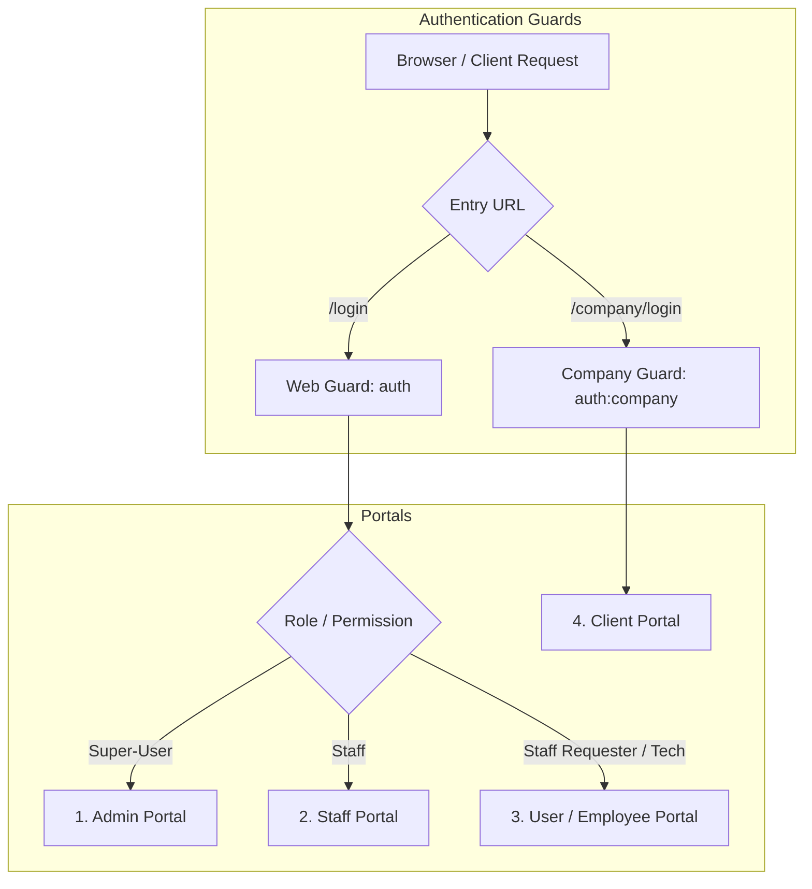

# FTS Portal — Complete Project Documentation & Technical Reference

---

## 1. Executive Summary & System Overview

**FTS Portal** is an enterprise-grade ERP and operations management platform built for engineering, security systems (CCTV, Access Control, Fire Alarm), facility management, and low-current contracting operations. It handles the complete business lifecycle across 4 distinct user dimensions:
* **Admin Portal:** Central executive command, user & role management, financial double-entry ledgers, multi-level purchase order approvals, and HR compliance radars.
* **Staff Portal:** Operational workflows for sales engineers, project managers, and procurement officers (inquiry pipeline, quotation estimation, project tracking, vendor LPOs).
* **User / Employee Portal:** Self-service workspace for field technicians and staff (leave requests, salary advance requests, AMC visit report submissions, offline drafts, mobile QR attendance).
* **Client / Company Portal:** Customer self-service extranet for clients to track active quotations, approved invoices, accepted LPOs, and branch profiles.

---

## 2. Technology Stack & Architecture

| Layer | Technology | Details |
| :--- | :--- | :--- |
| **Framework** | Laravel 7.27 | PHP Web Application Framework |
| **Runtime** | PHP 7.4 (CLI & FPM) | Runtime requirement (PHP 8.x is incompatible due to deprecations) |
| **Database** | MySQL 5.7+ / MariaDB 10.4+ | Relational schema (`fts_portal`, port 3306) |
| **Admin UI** | AdminLTE 3 / Bootstrap 4 / Blade | Responsive layout with role-based navigation |
| **Data Tables** | Yajra Laravel DataTables | Server-side paginated, searchable, exportable tables |
| **Reactive UI** | Laravel Livewire 1.x & Vue 2 | Dynamic UI widgets and reactive submenus |
| **Access Control** | Spatie Laravel-Permission 3.4 | Role-Based Access Control (RBAC) |
| **Accounting Engine** | CustomBalanceManager & Illuminatech | Real-time double-entry transaction ledgers |
| **Media Library** | Spatie Media Library 7.0 | File attachments, digital signatures, and inspection photos |
| **PDF Generation** | Barryvdh DomPDF & Snappy (wkhtmltopdf) | Automated branded invoice, quotation, and report PDF generation |

---

## 3. Quick Setup & Local Launch

```powershell
# 1. Navigate to project root
cd "d:\FTSITS\ft_portal_base(2)\ft_portal_base"

# 2. Configure environment (Ensure PHP 7.4 in Herd and MySQL in XAMPP)
Copy-Item .env.example .env
php artisan key:generate

# 3. Create database and migrate 131 tables
php artisan migrate

# 4. Seed system permissions, roles, and realistic sample data
php artisan db:seed

# 5. Link public storage for uploads and signatures
php artisan storage:link

# 6. Start the local server
php artisan serve --port=8001
```
Application URL: **`http://127.0.0.1:8001`**

---

## 4. Multi-Portal Architecture & Credentials Summary

| Portal | Target Audience | Login URL | Default Email | Password | Access Rights |
| :--- | :--- | :--- | :--- | :--- | :--- |
| **Admin Portal** | Executives, Directors, Head of Accounts | `/login` | `admin@example.com` | `password` | Super-User: Full administrative, financial, approval, and user governance |
| **Staff Portal** | Sales, Estimators, Project Supervisors | `/login` | `staff@example.com` | `password` | Staff: Operational modules (Inquiries, Quotations, Projects, LPOs, Products) |
| **User Portal** | Employees, Technicians, Site Labor | `/login` | `user@user.com` | `password` | Self-Service: My Requests, Leave/Passport workflows, AMC Reports, QR Attendance |
| **Client Portal** | External Customers, Facility Managers | `/company/login` | `client@example.com` | `password` | Client Extranet: Company quotations, billing invoices, and accepted LPO-ins |

---

## 5. Step-by-Step Portal Documentation



---

### 5.1 Admin Portal (Super-User)

#### Purpose & Scope
The Admin Portal is the central nervous system for executive directors, operations managers, and senior accountants. It oversees financial ledgers, system user security, company-wide compliance, and multi-tier approval chains.

#### How to Access:
* **URL:** `http://127.0.0.1:8001/login`
* **Credentials:** `admin@example.com` / `password`

#### Step-by-Step Features & Workflows:

1. **Executive Dashboard (`/home`):**
   * **Real-time Metrics:** Displays company counters for active Clients, Projects, Pending Quotations, and System Users.
   * **Compliance Radar:** Scans all employees and labor records. Highlights in red any Passport, Visa, Emirates ID, or Labor Card expiring within the next 30 days.
   * **Accounts Alert Feed:** Lists overdue customer invoices (>30 days), uncleared PDC cheques, and pending payment receipts requiring reconciliation.

2. **User & Access Governance (`/users`, `/roles`):**
   * **Creating a New Staff Member:**
     1. Navigate to **Users** in the top navigation.
     2. Click **Add New**. Enter full name, corporate email, and password.
     3. Select roles (e.g., `Super-User`, `Staff`, `Staff Requester`, `Payment Booking Approver`).
     4. Save to immediately apply Spatie permission gates.
   * **Custom Roles & Permissions:** Create granular roles (e.g., *Site Engineer*, *Procurement Specialist*) and bind them to specific actions (`quotations`, `invoices`, `deletes`).

3. **Multi-Tier Procurement Approvals (`/purchase-orders-admin/index`):**
   * Review purchase orders submitted by department managers.
   * Inspect attached vendor quotes, project allocation, and credit term conditions.
   * Click **Approve & Email** to issue official PO documents to vendors, or **Reject / Hold** with revision notes.

4. **Two-Person HR Request Sign-off (`/request-approvals`):**
   * Employee leave applications, passport release requests, and salary advance requests arrive in this queue.
   * Review technician history, available vacation balance, and pending project assignments before granting formal digital sign-off.

5. **Double-Entry Financial Ledgers (`/accounts`, `/reports/trial-balance`):**
   * View the unified Chart of Accounts (`sales`, `account_receivable`, `account_payable`, `material_expense`, `vat_out`, `vat_in`).
   * Generate real-time Trial Balance, Customer Ledger Statements, and VAT 201 return audit sheets.

---

### 5.2 Staff Portal (Operations, Sales & Engineering)

#### Purpose & Scope
The Staff Portal empowers sales engineers, estimators, project managers, and procurement officers to drive core business revenue and fulfill project commitments.

#### How to Access:
* **URL:** `http://127.0.0.1:8001/login`
* **Credentials:** `staff@example.com` / `password`

#### Step-by-Step Features & Workflows:

1. **CRM & Inquiries Pipeline (`/inquiries`):**
   * **Step 1 — Ingestion:** Click **Create Inquiry**. Select customer name, lead source (Call, Email, Referral), inquiry type (`Project`, `AMC`, `Installation`), and priority.
   * **Step 2 — Department Review (`/inquiries/{id}/department/review`):** Technical head reviews scope and assigns a field engineer for site survey.
   * **Step 3 — Site Survey Report (`/inquiries/{id}/engineer/report`):** Field engineer records site layout, cable route distances, required power points, and photos.
   * **Step 4 — Sales Conversion (`/inquiries/sales/pipeline`):** Sales team opens the survey report, establishes bill of materials, and converts the lead into an active Quotation.

2. **Quotation Generation & PDF Export (`/quotations`):**
   * **Step 1 — Create Quote:** Click **Add Quotation**. Select client company, reference inquiry, and tax scheme.
   * **Step 2 — Line Items:** Add items from the master catalog (`/products`) or input custom scope items with unit price, margin %, and installation labor.
   * **Step 3 — Terms & Approvals:** Configure payment terms (e.g., 50% Advance, 40% Delivery, 10% Handover).
   * **Step 4 — Download & Send:** Click **Export PDF** to generate an official, branded commercial proposal ready for the client.

3. **Project Execution & AMC Management (`/projects`):**
   * Once a quotation is accepted, click **Convert to Project**.
   * Set project commencement date, allocated site supervisor, contract value, and visit frequency for AMCs (e.g., Quarterly visits).
   * Track project extensions, milestone completions, and generate operational progress reports.

4. **Procurement & Local Purchase Orders (`/purchase-orders`, `/lpoouts`):**
   * Raise materials requests against active projects.
   * Select registered vendors from the directory (`/vendors`).
   * Specify payment preferences: Cash on Delivery, Bank Wire, or PDC (Post-Dated Cheque specifying number of days, e.g. 60 days).

---

### 5.3 User / Employee Self-Service Portal

#### Purpose & Scope
Designed for day-to-day employees, field technicians, and labor personnel. Provides self-service HR forms, mobile-first field visit report forms, and site attendance check-in.

#### How to Access:
* **URL:** `http://127.0.0.1:8001/login`
* **Credentials:** `user@user.com` / `password`

#### Step-by-Step Features & Workflows:

1. **Self-Service Requests — "My Requests" (`/own-staff-request`):**
   * **Step 1:** Open the **My Requests** navigation menu.
   * **Step 2 — New Request:** Click **Create Request**.
   * **Step 3 — Select Request Type:**
     * *Annual / Emergency Leave:* Specify start date, end date, and vacation reason.
     * *Salary Advance / Loan:* Specify requested amount and repayment terms.
     * *Passport / Emirates ID Release:* Specify travel dates or governmental renewal requirement.
     * *Device / Tool Request:* Request laptops, OTDR testers, drills, or safety gear.
   * **Step 4 — Track Status:** The user sees a real-time progress indicator (`Pending` ➔ `Manager Review` ➔ `Director Approved`).

2. **AMC Site Visit Reports (`/projects/visit-form`):**
   * Field technicians on customer sites open this form on a phone or tablet.
   * **Step 1:** Select the active Client and Project. The system auto-generates a unique reference number.
   * **Step 2 — System Inspection:** Check off inspected subsystems (CCTV Cameras, NVR storage, Power supplies, Access control magnetic locks).
   * **Step 3 — Save Drafts (`/projects/amc-drafts`):** Technicians in basements without internet connectivity can click **Save Draft** to store progress offline.
   * **Step 4 — Client Digital Signature:** Present the device to the client's facility manager to sign directly on the touchscreen.
   * **Step 5 — Final Submit:** Uploads the completed inspection record and triggers automated PDF report delivery to both client and management.

3. **QR Code & Geofenced Site Attendance (`/api/v1/attendance`):**
   * Technicians scan the dynamic QR code displayed at the main site or branch.
   * The system checks device GPS coordinates against the project geofence radius (e.g. 500m) to confirm on-site presence.

---

### 5.4 Client / Company Portal (Customer Extranet)

#### Purpose & Scope
A dedicated client-facing interface that provides commercial transparency. Clients can view all commercial documents, past and current invoices, accepted purchase orders, and track project status without calling the office.

#### How to Access:
* **Login URL:** `http://127.0.0.1:8001/company/login`
* **Credentials:** `client@example.com` / `password`
* **Associated Client:** Al Futtaim Engineering

#### Step-by-Step Features & Workflows:

1. **Client Dashboard (`/company/dashboard`):**
   * **Company Overview Card:** Displays the client's registered legal name, Tax Registration Number (TRN/VAT), billing address, shipping address, and primary account contact.
   * **Live Summary Counters:** Displays total active quotations, billed invoices, and processed LPO-ins.

2. **Quotations Review:**
   * Review all quotations submitted by FTS to their organization.
   * Inspect quotation reference, revision numbers, date issued, and total net amount (including VAT).
   * Download official quotation proposal PDFs.

3. **Tax Invoices & Payment Due Tracking:**
   * View all generated tax invoices.
   * View invoice status: `Paid`, `Partially Paid`, or `Pending`.
   * Download official Tax Invoices for internal accounting and VAT filing.

4. **LPO-In Tracker:**
   * Review client-issued purchase orders that FTS has received, logged, and acknowledged.

5. **Company Profile & Contact Management (`/company/profile`):**
   * Keep billing emails, secondary contact numbers, and delivery addresses updated so invoice deliveries and technician dispatches reach the correct personnel.

---

## 6. End-to-End Operational Lifecycle Walkthrough

```
[Lead / Inquiry] 
       │
       ▼
[Field Survey] ──▶ Technician fills /inquiries/{id}/engineer/report
       │
       ▼
[Quotation] ─────▶ Sales generates Quote at /quotations & sends PDF
       │
       ▼
[Client Portal] ─▶ Client reviews quote at /company/dashboard
       │
       ▼
[Active Project] ─▶ Admin converts to Project at /projects
       │
       ├─────────────────────────────────────────┐
       ▼                                         ▼
[Procurement]                             [Field Maintenance]
LPO issued to Vendor (/purchase-orders)   Technician submits AMC Visit Report
Vendor delivers materials                 Client signs on tablet screen
       │                                         │
       ▼                                         ▼
[Tax Invoice] ◀──────────────────────────────────┘
Accounts generates Tax Invoice at /invoices
Auto-credits Sales & debits Accounts Receivable
       │
       ▼
[Receipt Voucher]
Client pays via Bank Transfer / Cheque
Auto-credits Accounts Receivable & debits Bank Account
```

---

## 7. Developer & Maintenance Reference

### Key Models & File Locations

| Module | Eloquent Model | Controller | Primary Views |
| :--- | :--- | :--- | :--- |
| **Inquiries** | `App\Models\Inquiry` | `InquiryController` | `resources/views/inquiries/` |
| **Quotations** | `App\Models\Quotation` | `QuotationController` | `resources/views/quotations/` |
| **Projects & AMC** | `App\Models\Project` | `ProjectController`, `ProjectReportController` | `resources/views/projects/` |
| **Invoices** | `App\Models\Invoice` | `InvoiceController` | `resources/views/invoices/` |
| **Double-Entry Ledgers** | `App\Models\Account`, `Transaction` | `AccountController`, `CustomBalanceManager` | `resources/views/accounts/` |
| **Staff & HR** | `App\Models\StafProfile` | `StafProfileController`, `StaffOwnRequestController` | `resources/views/staf/` |
| **Client Portal** | `App\Models\Company` | `CompanyHomeController`, `CompanyLoginController` | `resources/views/company_home.blade.php` |

### Useful Console Commands

```powershell
# Start local server on port 8001
php artisan serve --port=8001

# Clear all application caches
php artisan config:clear
php artisan route:clear
php artisan view:clear
php artisan cache:clear

# Interactive database debugging
php artisan tinker

# Rebuild fresh database with all seeders
php artisan migrate:fresh --seed
```
